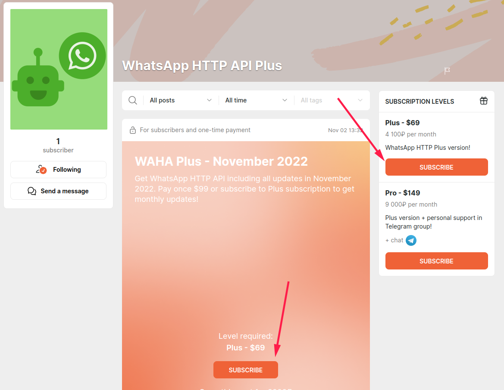

## Overview

**WAHA** is distributed in two versions:

1. Core  the basic version that meet almost 80% people’s needs. 100% free and open source.
2. Plus  the version with advanced messages, security, and reliability features.

**If you enjoy Core  version and would like to support the project** - you can subscribe on Core level.
It's not expensive, but it supports the project a lot!
- [Boosty ->](https://boosty.to/wa-http-api)
- [Patreon ->](https://patreon.com/wa_http_api)


## Features

The Plus additional features are:

1. [**Send images\files\voices** →]()
2. [**Receive images\files\voices** →]()
3. [**Webhook retries** →]()
4. [**Security** →]()
5. [**Saving sessions** →]()
6. [**Support multiple sessions** →]()
7. **Instant updates** - no one month delay in getting bugfixes or new features
8. **Priority in support** - on both bugs and features

## Differences

What is the difference between **WAHA Plus** and other SaaS solutions for WhatsApp HTTP API?

|                    |                     WAHA Plus                     |                                                                            Others |
|--------------------|:-------------------------------------------------:|----------------------------------------------------------------------------------:|
| **Sessions**       |   ✔️ No limits on **accounts** or **servers**!    |                                                      ➖ One account for $50/month. |
| **Infrastructure** | ✔️ On-Premise - your server, your infrastructure! |                                                        ➖ Insecure cloud solution. |
| **Security**       |                 ✔️ No data leaks!                 | ➖ You have to give access to customers' data - phone number, name, your messages. |
| **License Term**               |               ✔️ No license checks!               |                                                                       ➖ One month |
| **Message price**  |             ✔️ All messages are Free!             |                     ➖ Some solutions have a price for messages - $1/100 messages. |
| **Expenses**       |               ✔️ $19 **donation**!                |                                                 ➖ Monthly payment starts from $50 |

## Donations

WAHA Plus version is available through **donations** (subscriptions).

**It doesn't require monthly subscriptions, once installed on your server - it always works!**
(until WhatsApp made backward-incompatible changes, and you have to update the image)


We do not sell **WAHA**, it's not a purchase. It's a donation.

We treat our projects like art. You donate to the project and get a bit more from it as a thank-you. 😊

Treat **WAHA Plus** it as an additional episode, behind-the-scenes videos, our nude photos 😊



We donate most of the donations down to the stream to the underlying libraries and tools - JS-community, Node, other libraries authors, personal contributors.
By donating to the **WAHA** you donate to the Open Source world!

## Get Plus 

For $19 one-time donation you get:
1. **Secret password** for Docker Hub to download Plus image: `devlikeapro/whatsapp-http-api-plus`.
2. **All updates for one month** for the Plus image.
3. **NO LICENSE CHECKS** on installed instances!
4. **NO LICENSE EXPIRATION** on installed instances! We repeated it twice to make sure that you've got it 😊



### Boosty
We use Boosty to get donations (Patreon analogue) - [https://boosty.to/wa-http-api](https://boosty.to/wa-http-api).

Go ahead and get your monthly password to get no license expiration WhatsApp HTTP API!





### Patreon
You can support the project and get WAHA Plus version on Patreon: [https://patreon.com/wa_http_api](https://patreon.com/wa_http_api)




### Install Plus
After you get the password, use it to login and download docker image:
```bash
docker login -u devlikeapro -p {PASSWORD}
docker pull devlikeapro/whatsapp-http-api-plus
docker logout
```
Then in all commands use **Plus** image `devlikeapro/whatsapp-http-api-plus` instead of Core `devlikeapro/whatsapp-http-api`.
