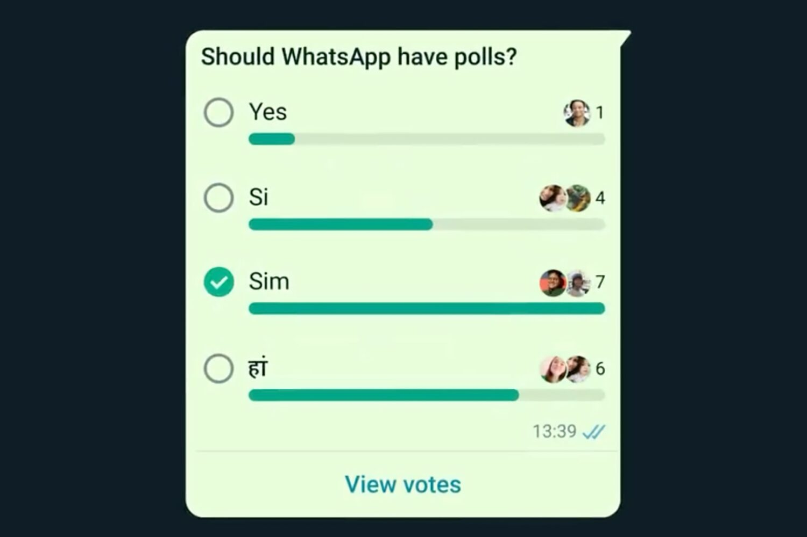
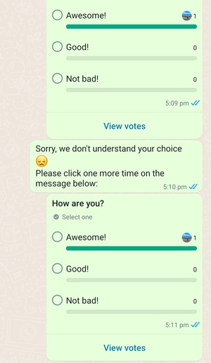

Waiting for WEBJS engine to support it, and we'll add it ASAP!



## Endpoints
See the list of engines [**that support the feature ->**]().

### Send poll

Use the endpoint to send a poll!

```bash
POST /api/sendPoll
```

The request body is pretty simple:
```json
{
  "session": "default",
  "chatId": "123123123@c.us",
  "poll": {
    "name": "How are you?",
    "options": [
      "Awesome!",
      "Good!",
      "Not bad!"
    ],
    "multipleAnswers": false
  }
}
```

The response you get back:

```json
{
  "id": "true_321321321@c.us_83ACBAAAAAAAAAAAAAAAAAAAA",
  "other-fields-here": "value"
}
```

You must save the `id` field from the response in your database so that you can identify the poll for which you receive
a vote (see webhook events below).

## Webhooks
See the list of engines [**that support the feature ->**]().

### poll.vote

With this event, you receive new votes for the poll sent.

#### Vote from a user in direct messages.

```json
{
  "event": "poll.vote",
  "session": "default",
  "payload": {
    "vote": {
      "id": "false_1111111111@c.us_83ACBE602A05C79B234B54415E95EE8A",
      "to": "me",
      "from": "1111111@c.us",
      "fromMe": false,
      "selectedOptions": [
        "Awesome!"
      ],
      "timestamp": 1692861427
    },
    "poll": {
      "id": "true_1111111111@c.us_BAE5F2EF5C69001E",
      "to": "1111111111@c.us",
      "from": "me",
      "fromMe": true
    }
  },
  "engine": "NOWEB"
}
```

#### Do I receive votes only for my polls?

No, you receive all votes. Keep in mind that you'll get all votes with this event, even from other polls. To identify
that it's your poll, look at the `poll.fromMe` field.

#### How to handle multiple-answer votes

For `multipleAnswers: true`, you receive the `selectedOptions` with all the selected values at a certain moment. So if a
user has chosen 3 options from the poll, you will receive **3** `poll.vote` events:

1. `selectedOptions: ["First"]`
2. `selectedOptions: ["First", "Second"]`
3. `selectedOptions: ["First", "Second", "Third"]`

#### Timestamp

If a user clicks on the poll multiple times, you will receive multiple `poll.vote` events. This is true for
both `multipleAnswers: false` (when a user changes their mind about answers) and `multipleAnswers: true` (when a user
selects two or more options) events.

There is a little chance that you may receive votes in the wrong order (due to the nature of HTTP and Webhooks),
like `1-3-2` instead of `1-2-3`. To determine the right order, look at the `timestamp` field. The event with a
higher `timestamp` value is more recent.

👉 It's important to save the `timestamp` for each vote in your database and compare them as numbers, without converting to
internal datetime. Right now, the `timestamp` shows the timestamp in seconds, but it may be changed to milliseconds in
the future.

#### Vote from a user in a group

```json
{
  "event": "poll.vote",
  "session": "default",
  "payload": {
    "vote": {
      "id": "false_3333333333333@g.us_1C18A7EAADD2A8D0324755D241C4238A",
      "to": "3333333333333@g.us",
      "from": "1111111111@c.us",
      "fromMe": false,
      "selectedOptions": [
        "Awesome!"
      ],
      "timestamp": 1692861427
    },
    "poll": {
      "id": "true_3333333333333@g.us_BAE5304BA1ECF704",
      "to": "33333333333333@g.us",
      "from": "222222222@c.us",
      "fromMe": true
    }
  },
  "engine": "NOWEB"
}
```

### poll.vote.failed

There may be cases when WAHA fails to decrypt a vote from the user. In such cases, you will receive
a `poll.vote.failed` event on your webhook.

The payload for `poll.vote.failed` is the same as for `poll.vote`, but with an empty list in `selectedOptions`.

```json
{
  "event": "poll.vote.failed",
  "session": "default",
  "payload": {
    "vote": {
      "id": "false_11111111111@c.us_2E8C4CDA89EDE3BC0BC7F605364B8451",
      "to": "me",
      "from": "111111111@c.us",
      "fromMe": false,
      "selectedOptions": [],
      "timestamp": 1692956972
    },
    "poll": {
      "id": "true_1111111111@c.us_BAE595F4E0A2042C",
      "to": "111111111@c.us",
      "from": "me",
      "fromMe": true
    }
  },
  "engine": "NOWEB"
}
```

#### How should I handle poll.vote.failed events?

When you send a poll, save the poll configuration (question and options) in your database with the `id` field from the
response you received from `POST /api/sendPoll`.

Later, when you receive a `poll.vote.failed` event, find the `id` for the poll in the database and repeat the same
question to the user, apologizing for the inconvenience.
For example, you can say:

> Sorry, we don't understand your choice 😞
>
> Please click one more time on the message below 👇

After the user clicks on the poll again, you will receive a `poll.vote` event with their choice.



#### How to test poll.vote.failed events?

To receive `poll.vote.failed` events, follow these steps:

1. Start a session and authorize it with a QR code.
2. Send a poll to a chat.
3. Stop the session (logout is not required).
4. Start the session again.
5. Vote on the poll.
6. You will receive a `poll.vote.failed` event.

#### Why does the poll.vote.failed event occur and when will it be fixed?

The issue occurs because WAHA does not have a proper storage system, but polls require proper storage in order to
decrypt votes later.

There will be two fixes for this:

1. In the short term, a [local file storage](https://github.com/devlikeapro/whatsapp-http-api/issues/188) will be used
   to save poll keys.
2. In the long term, work is being done
   on [remote storages](https://github.com/devlikeapro/whatsapp-http-api/issues/41).

Even after these fixes are implemented, it's better to handle `poll.vote.failed` events anyway, so your application is
prepared for such cases!
