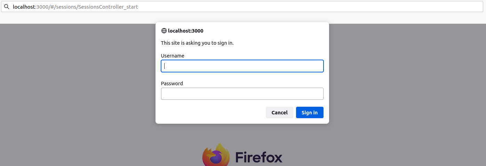
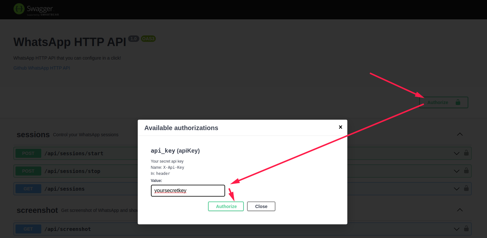



We do not recommend exposing the API on any public networks!

Either protect the API with [Api Key](https://www.fortinet.com/resources/cyberglossary/api-key) or deny access by using
firewalls.

## Swagger Security 
### Username and password
If you want to hide the project Swagger panel under the password - run the following command to hide under `admin/admin`
login and password.

```bash
docker run -it -e WHATSAPP_SWAGGER_USERNAME=admin -eWHATSAPP_SWAGGER_PASSWORD=admin devlikeapro/whatsapp-http-api-plus
```

Open http://localhost:3000/ and enter `admin / admin` in the inputs:





### Disable Swagger
You also can hide swagger completely by setting `WHATSAPP_SWAGGER_ENABLED=false` environment variable.




## API security 

You can protect the API by requiring Api Key in a request's headers.



### Set Api Key

Set `WHATSAPP_API_KEY=yoursecretkey` environment variable for that:

```bash
docker run -it -e WHATSAPP_API_KEY=yoursecretkey devlikeapro/whatsapp-http-api-plus
```

### Use Api-Key in Swagger

After you set api key - to authorize on swagger use **Authorize** button at the top:


### Add X-Api-Key header

To authorize requests - set `X-Api-Key` header to `yoursecretkey` for all requests that go to WAHA.

#### Python
Example for Python **requests** library:

```python
import requests

headers = {
  'Content-type': 'application/json',
  'X-Api-Key': 'yoursecretkey',
}
requests.get("http://localhost:3000/api/sessions", headers=headers)
```

## Webhook security 
To make sure that you get a webhook from your WAHA instance - you can use **HMAC authentication**.
Read more about it on [Webhooks page ->]()

