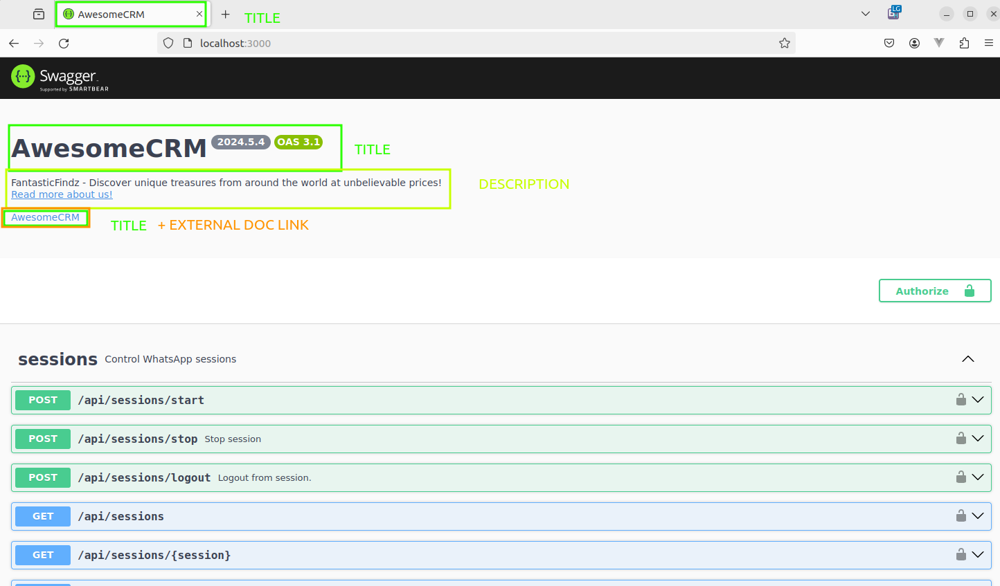

## Overview
The project provides HTTP API (REST), which is documented with OpenAPI specification and Swagger UI.

<video autoplay loop muted playsinline controls='noremoteplayback' width="100%" poster='/images/swagger.png'>
  <source src="/videos/swagger-overview.webm" type="video/webm" />
  Download the <a href="/videos/swagger-overview.webm">Swagger Overview video</a> .
</video>

You can see all available endpoints, request/response examples, and even execute them directly from the Swagger UI.

Later version:
- [OpenAPI specification ->](/swagger/openapi.json)
- [Swagger documentation ->](/swagger)

You can find Swagger documentation on the following url after you
[install and started]( ) it:
- Swagger: [http://localhost:3000](http://localhost:3000).
- OpenAPI: [http://localhost:3000/-json](http://localhost:3000/-json).

## Configuration
- `WHATSAPP_SWAGGER_CONFIG_ADVANCED=true` - enables advanced configuration options for Swagger documentation - you can customize host, port and base URL for the requests.
  Disabled by default.
- `WHATSAPP_SWAGGER_ENABLED=false` - disables Swagger documentation. Enabled by default. Available in **WAHA Plus** only.
- `WHATSAPP_SWAGGER_USERNAME=admin` and `WHATSAPP_SWAGGER_PASSWORD=admin` - these variables can be used to protect the Swagger panel
  with `admin / admin` credentials. This does not affect API access. Available in **WAHA Plus** only.

Read more about security settings for Swagger and API on [**Security page** ->]().

### White label
You can show your own brand in the Swagger documentation.


<br/>
<br/>

👉 Swagger White Label is available in [**WAHA Plus**]()  version only.

Use the following environment variables to customize the Swagger documentation:
- `WHATSAPP_SWAGGER_TITLE` - the title of the Swagger documentation and some other places.
- `WHATSAPP_SWAGGER_DESCRIPTION` - Markdown formatted description of your API.
- `WHATSAPP_SWAGGER_EXTERNAL_DOC_URL` - URL to the external documentation.

**Example** (consider using [docker-compose](https://github.com/devlikeapro/whatsapp-http-api/blob/core/docker-compose.yaml#L15-L38) or other methods to store these settings):
```bash
docker run -it -p 3000:3000 -e WHATSAPP_SWAGGER_TITLE="AwesomeCRM" -e 'WHATSAPP_SWAGGER_DESCRIPTION=<p>FantasticFindz - Discover unique treasures from around the world at unbelievable prices!<br/> <a href='https://google.com'>Read more about us!</a></p>' -e "WHATSAPP_SWAGGER_EXTERNAL_DOC_URL=https://google.com" devlikeapro/whatsapp-http-api-plus
```


