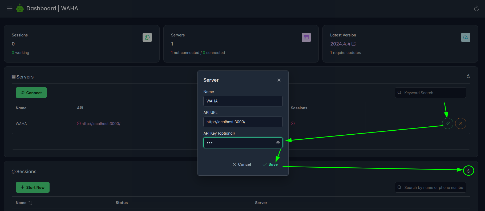

## Overview

**Dashboard** is a UI to manage your WhatsApp sessions!

<video autoplay loop muted playsinline controls='noremoteplayback' width="100%" poster='/images/waha-dashboard.png'>
  <source src="/videos/waha-dashboard-overview.webm" type="video/webm" />
  Download the <a href="/videos/waha-dashboard-overview.webm">Dashboard Overview video</a> .
</video>

👉 **Dashboard** is available in [**WAHA Plus**]()  version only.

You can access **Dashboard** by running the project and opening
<a href="http://localhost:3000/dashboard" target="_blank">http://localhost:3000/dashboard</a>
(or similar, but with <a href="/dashboard" target="_blank">/dashboard</a> at the end).

ℹ️ **Default username and password**: `waha/waha`

```bash
docker run -it -p 3000:3000/tcp devlikeapro/whatsapp-http-api-plus
```

If you're using [API Key](), remember to set up the key in the dashboard.



## Configuration

When running WAHA you can set the following environment variables to configure the dashboard:

- `WAHA_DASHBOARD_ENABLED=true` - enable or disable the dashboard, by default `true`. Set to `false` to disable the
  dashboard.
- `WAHA_DASHBOARD_USERNAME=waha` - username used to log in, by default `waha`.
- `WAHA_DASHBOARD_PASSWORD=waha` - password used to log in, by default `waha`.

```bash
docker run -it -p 3000:3000/tcp -e WAHA_DASHBOARD_USERNAME=waha -e WAHA_DASHBOARD_PASSWORD=waha devlikeapro/whatsapp-http-api-plus
```

## Multiple servers
If you wish to connect, control and manage multiple servers in a single "dashboard", consider using
[WAHA Hub]() - central management server to help you build reliable infrastructure!

## Bug reports and feature requests
If you're experiencing any issues or have a feature request, please create an issue in the
[WAHA GitHub](https://github.com/devlikeapro/whatsapp-http-api/issues)

