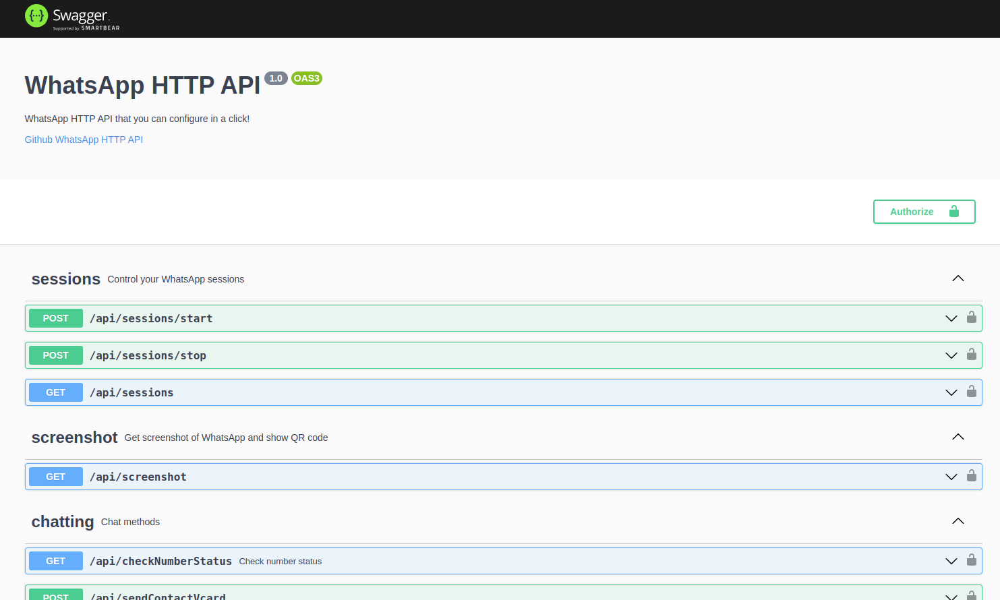
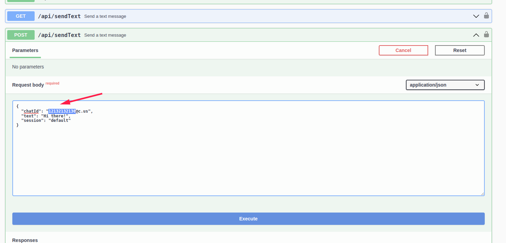

On this page you're going to install WAHA, run it, authenticate the client using QR code and send the first text message
to WhatsApp!

## Requirements

Only thing that you must have - installed docker. Please follow the original
instruction <a href="https://docs.docker.com/get-docker/" target="_blank" rel="noopener">how to install docker -></a>.

When you are ready - come back and follows the below steps to send the first text message to WhatsApp via HTTP API!


Docker makes it easy to ship all-in-one solution with the runtime and dependencies. You don't have to worry about
language-specific libraries or chrome installation.

Also Docker makes installation and update processes so simple, just one command!


## Send your first message

Let's go over steps that allow you to send your first text message via WhatsApp HTTP API!

### 1. Download image

Assuming you have installed [Docker](https://docs.docker.com/get-docker/), let's download the image.

 For Core version the command is

```bash
docker pull devlikeapro/whatsapp-http-api
```

 For Plus version, we use login to get the image before:

```bash
docker login -u devlikeapro -p {PASSWORD}
docker pull devlikeapro/whatsapp-http-api-plus
docker logout
```

Read more about how to get `PASSWORD` for [Plus Version →]()

#### 1.1 Download image on ARM

If you're using ARM (like Apple Silicon, Apple M1, etc) - use following commands to download the image

 For Core version the command is
```bash
# Download the image
docker pull devlikeapro/whatsapp-http-api:arm
# Rename it, so you can use devlikeapro/whatsapp-http-api image in other place
docker tag devlikeapro/whatsapp-http-api:arm devlikeapro/whatsapp-http-api
```

 For Plus version the command is:
```bash
docker login -u devlikeapro -p {PASSWORD}
docker pull devlikeapro/whatsapp-http-api-plus:arm
docker logout

# Rename it, so you can use devlikeapro/whatsapp-http-api image in other place
docker tag devlikeapro/whatsapp-http-api-plus:arm devlikeapro/whatsapp-http-api
```

### 2. Run WhatsApp HTTP API

Run WhatsApp HTTP API:

```bash
docker run -it --rm -p 127.0.0.1:3000:3000/tcp --name whatsapp-http-api devlikeapro/whatsapp-http-api

# It prints logs and the last line must be
# WhatsApp HTTP API is running on: http://[::1]:3000
```

Open the link in your browser [http://localhost:3000/](http://localhost:3000/) and you'll see API documentation
(Swagger).





### 3. Start a new session

To start a new session you should have your mobile phone with installed WhatsApp application close to you.

Please go and read how what we'll need to a bit
later:
<a href="https://faq.whatsapp.com/381777293328336/?helpref=hc_fnav" target="_blank">
How to log in - the instruction on WhatsApp site
</a>

When your ready - find `POST /api/session/start`, click on **Try it out**, then **Execute** a bit below.

The example payload:

```json
{
  "name": "default"
}
```


By using the request with `name` values you can start multiple session (WhatsApp accounts) inside the single docker
container in Plus
 version and only one account in Core  version.

Read more about [multiple sessions →]()

### 4. Get and scan QR

Find `GET /api/screenshot` and execute it, it shows you QR code.


**Scan the QR with your cell phone's WhatsApp app.**


### 5. Get the screenshot

Execute `GET /api/screenshot` after a few seconds after scanning the QR - it'll show you the screenshot of you Whatsapp
instance. If you can get the actual screenshot - then you're ready to start sending messages!


### 6. Send a text message

Let's send a text message - find `POST /api/sendText`  in [swagger](http://localhost:3000/) and change `chatId` this
way: use a phone international phone number without `+` symbol and add `@c.us` at the end.

For phone number `12132132131` the `chatId` is  `12132132131@c.us`.

The example payload:

```json
{
  "chatId": "12132132130@c.us",
  "text": "Hi there!",
  "session": "default"
}
```



Also, you can use `curl` and send POST request like this:

```bash
# Phone without +
export PHONE=12132132130
curl -d "{\"chatId\": \"${PHONE}@c.us\", \"text\": \"Hello from WhatsApp HTTP API\" }" -H "Content-Type: application/json" -X POST http://localhost:3000/api/sendText
```

## What is next?

- Right now you've sent simple text message, but you can send more! [Send messages →]()
- Read how to receive and response to messages [Receive messages →]()
- Make sure your [API is properly protected ->]()

